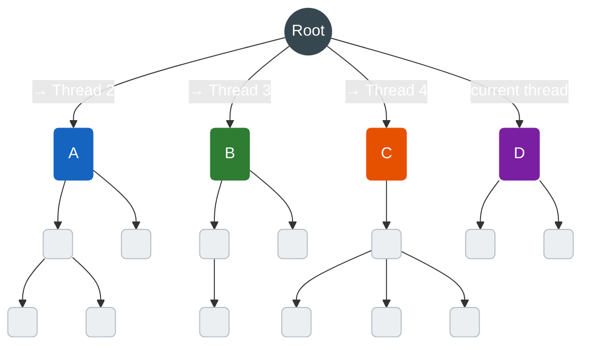
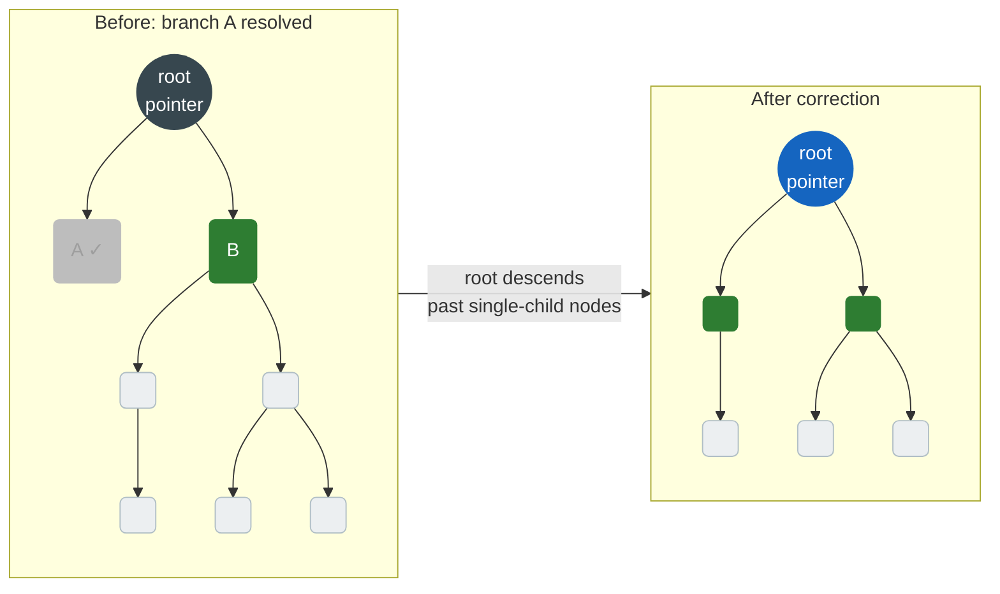

# Quasi-Horizontal

```cpp
auto* lb = gempba::mt::create_load_balancer(gempba::balancing_policy::QUASI_HORIZONTAL);
```

Implements [`load_balancer`](interfaces/load-balancer.md). The primary scheduling strategy of GemPBA and the main algorithmic contribution of the original research. Designed for branching algorithms where subtree sizes are unknown and highly unbalanced — which is the common case.

## The problem it solves

In a branch-and-bound search the recursion tree is highly unbalanced: one subtree might contain millions of nodes while its sibling contains three. Naive work-stealing picks whatever task is available — often a node near the leaves, carrying almost no remaining work. Threads finish quickly and idle while one thread drowns in the large subtree.

Quasi-horizontal avoids this by distributing work **near the root first**. Nodes close to the root are parents of the largest subtrees. Handing them to idle threads early gives each thread roughly equal downstream work.



Each thread receives a root-level child — one step below the tree root. Because these nodes are as high as possible, each thread inherits the largest possible share of remaining work.

## Per-thread root pointer

Each worker thread maintains a **root pointer**: a reference to the highest node in the tree this thread currently owns. When a thread pushes a branch to another thread, it hands off that subtree entirely.

As branches get resolved or pruned, the root pointer **descends**: if the current root has only one remaining child, there is no parallelism left at that level, so the pointer advances to that child. This continues until a real branching point (two or more pending children) or a leaf is reached. This is the **root correction** step.



Once A is resolved, keeping the root pointer at the original root adds traversal overhead on every future submission. Correction moves it down to B so the thread stays focused on live work only.

## Submission algorithm

When `try_local_submit` is called, the strategy:

1. **Pushes root-level siblings first.** If the submitting node has pending siblings at the current root level, it pushes *those* to idle threads before the current node. This is the horizontal spreading step.
2. **Prunes the current node** once no more root-level siblings remain.
3. **Delegates to a thread** if `should_branch()` is true, otherwise marks the node `DISCARDED`.
4. **Corrects the root pointer** — descends past any single-child nodes just resolved.

Tree navigation calls used:

```cpp
p_node.get_root()                   // current root for this thread
p_root.get_children_count()         // branches remaining at root level
p_root.get_second_leftmost_child()  // next sibling to push
p_node.get_leftmost_child()         // descend during root correction
```

## When to use

This is the default and recommended strategy for all branching algorithms. Use [Work-Stealing](work-stealing.md) only when you need a baseline for benchmarking.
