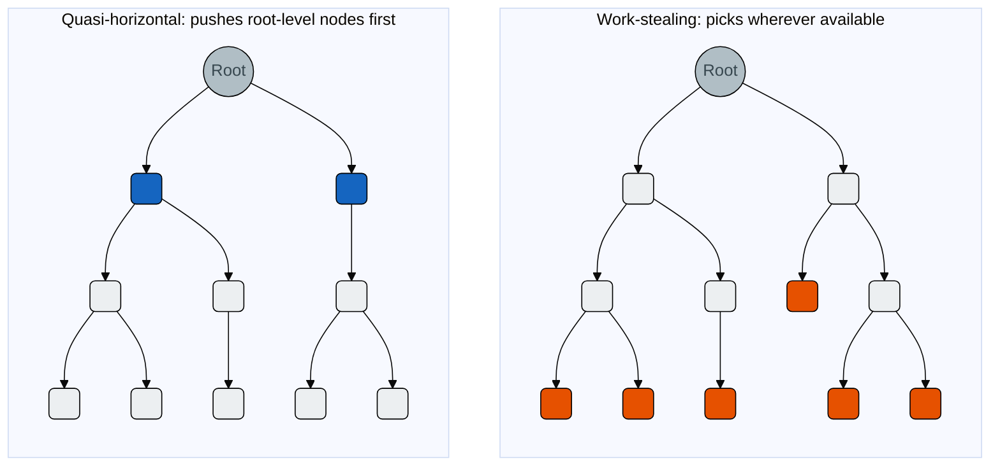

# Work-Stealing

```cpp
auto* lb = gempba::mt::create_load_balancer(gempba::balancing_policy::WORK_STEALING);
```

Implements [`load_balancer`](../../interfaces/load-balancer.md). A deliberately simple strategy: tasks are pushed to the thread pool queue as they arrive, idle threads pick them up in order. No tree structure is inspected, no root pointer is maintained.

---

## Submission algorithm

When `try_local_submit` is called:

1. Attempts a non-blocking lock on the internal mutex.
2. Returns `false` immediately if the lock is unavailable or the pool is full.
3. Prunes the node and delegates it to a thread if `should_branch()` is true.

No root tracking. No sibling search. No root correction.

---

## Comparison with Quasi-Horizontal



**Blue (QH)** — root-level nodes pushed early; each carries a large subtree.  
**Orange (WS)** — typical steal targets near the leaves; little remaining work.

|                                     | Quasi-Horizontal | Work-Stealing |
|-------------------------------------|------------------|---------------|
| Per-thread root tracking            | <span style="color:#388e3c">Yes</span> | <span style="color:#d32f2f">No</span> |
| Root-level sibling spreading        | <span style="color:#388e3c">Yes</span> | <span style="color:#d32f2f">No</span> |
| Root correction after pruning       | <span style="color:#388e3c">Yes</span> | <span style="color:#d32f2f">No</span> |
| Overhead due to parallel requests   | <span style="color:#388e3c">Low</span> | <span style="color:#d32f2f">Very high</span> |
| CPU utilization on unbalanced trees | <span style="color:#388e3c">High</span> | <span style="color:#f57c00">High (excessive tasks)</span> |
| Use case                            | <span style="color:#388e3c">Production</span> | <span style="color:#f57c00">Benchmarking baseline</span> |

---

## When to use

Primarily as a **comparison baseline** — for reproducing the benchmarks from the original paper, or for sanity-checking whether the overhead of [Quasi-Horizontal](quasi-horizontal.md) is a net negative on a specific workload.

On uniformly balanced trees, work-stealing may perform comparably to quasi-horizontal. On the unbalanced trees characteristic of real branch-and-bound problems it loses ground: stolen tasks tend to be near the leaves, carrying little remaining work, so threads finish quickly and idle.
