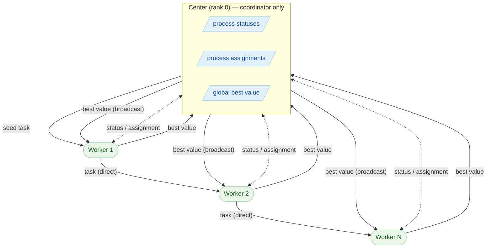
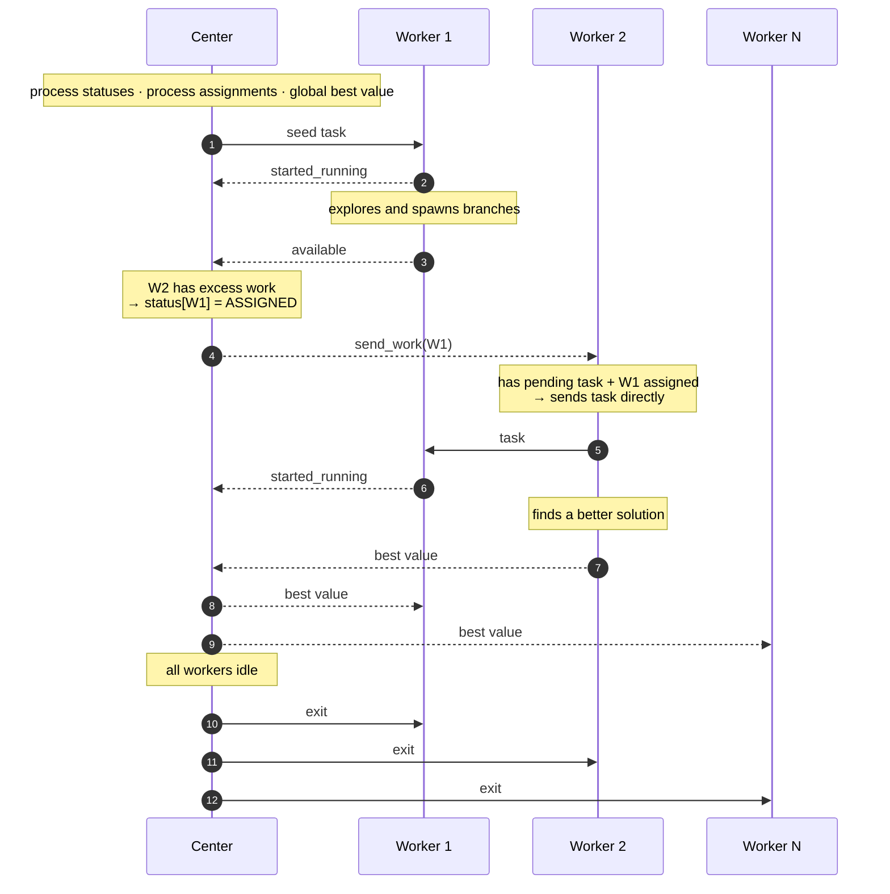
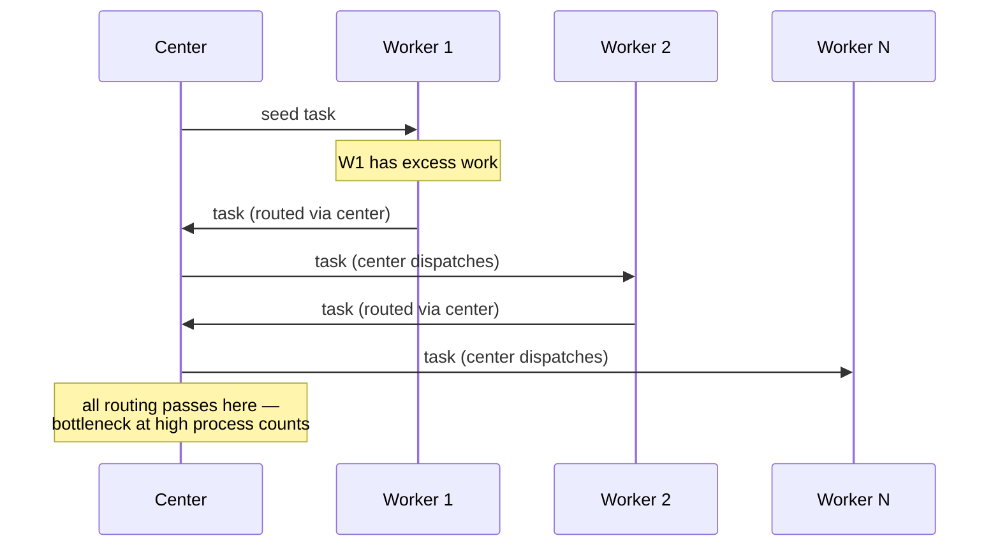

# Scheduler Topologies

GemPBA ships with two scheduler topologies for multiprocessing. The default
recommendation is `SEMI_CENTRALIZED`.

```cpp
// Semi-centralized (recommended)
auto* s = gempba::mp::create_scheduler(gempba::mp::scheduler_topology::SEMI_CENTRALIZED);

// Centralized (for comparison)
auto* s = gempba::mp::create_scheduler(gempba::mp::scheduler_topology::CENTRALIZED);
```

---

## Semi-Centralized (recommended)

### What the center does — and does not do

The center (rank 0) has a single responsibility: **knowing who is idle and assigning
available workers to busy ones**. It never holds tasks, never routes tasks, and never
participates in computation.

When a worker becomes idle it notifies the center. The center finds a working node that
has excess work and sends it a message — `send_work(r)` — where `r` is the idle worker.
The busy worker's communication thread receives this message and adds `r` to its list of
**waiting processes**. The next time the busy worker has a pending subtask, it sends it
directly to `r`.

The critical consequence: tasks only travel to workers that the center has confirmed are
idle. This eliminates the bounce-back problem that plagues decentralized strategies, where
a task sent to a peer may arrive after that peer has already received work from somewhere
else and must reject it — wasting a full round-trip.

### Communication model

The center never waits for a worker to query it — it **pushes** messages proactively the
moment a relevant state change occurs (a new best value, a worker assignment). Workers
know in real time whether they have a waiting process assigned to them; no polling
required.

### Network topology



**Solid arrows** — task or value payloads.  
**Dashed arrows** — lightweight signals (status changes, worker assignments); no task payload.

### Protocol walkthrough



Steps 4–7 are the heart of the strategy:

1. W1 notifies the center it is idle (`available`, step 4).
2. The center — which holds the authoritative status table — finds W2 as a working node,
   records `status[W1] = ASSIGNED`, and pushes `send_work(W1)` to W2 (step 6).
3. W2 now knows W1 is waiting. As soon as it has a pending subtask it sends it directly
   to W1 (step 7) — **the center is not involved in the actual data transfer**.
4. W1 accepts the task immediately and notifies the center it is running again (step 8).

Because the center's status table is the single source of truth and W1 was confirmed idle
before step 6 was ever triggered, the task is guaranteed to be accepted. No bounce-back.

### Why bounce-back matters

In a fully decentralized strategy, Worker A sends a task to Worker B based on its own
stale view of B's availability. By the time the message arrives, B may have received work
from somewhere else and must reject it — the task bounces back to A, consuming two full
network round-trips for zero progress. Under high load this compounds quickly.

The semi-centralized design makes stale status impossible. The center's process status
table is updated every time a worker's state changes, and a working node only sends a
task to a waiting process that the center itself has registered as idle.

---

## Centralized

All task routing passes through the center. The center is an active participant: workers
send their excess tasks to the center, and the center dispatches them onward.



At small process counts the centralized topology performs comparably to semi-centralized.
At scale, the center becomes the bottleneck: every task handoff — regardless of which
two workers are involved — must traverse the center twice (inbound + outbound). This is
the behavior the semi-centralized design was built to avoid.

The centralized scheduler is kept in the library for reproducing the paper's comparison
experiments and benchmarking custom scheduling strategies.

---

## Summary

| | Semi-Centralized | Centralized |
|---|---|---|
| Center role | Assigns idle workers to busy ones | Active task router |
| Task path | Worker → Worker (direct) | Worker → Center → Worker |
| Center sends | Lightweight assignment signals | Full task payloads |
| Communication model | Push-based | On-demand |
| Bounce-back | Eliminated | Possible |
| Center bottleneck | No | Yes, at scale |
| Recommended for | Production | Benchmarking |
