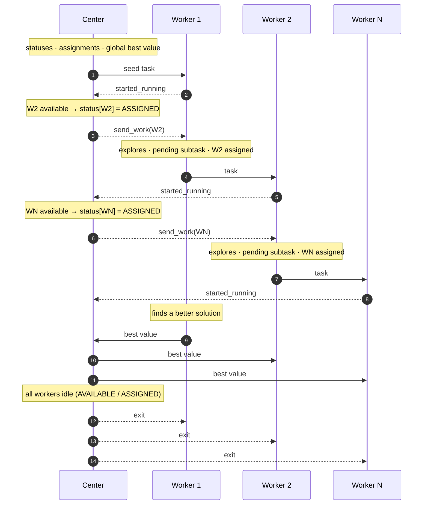
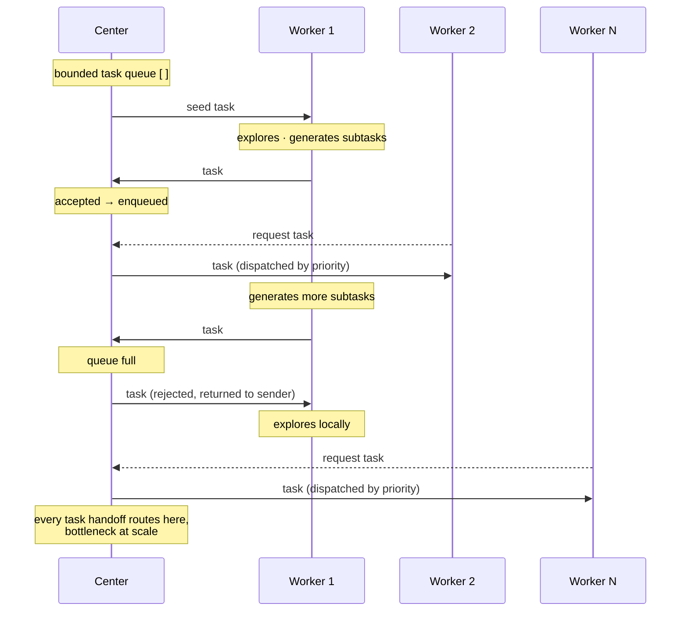
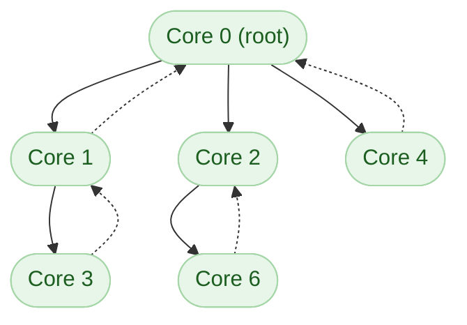

# Scheduler Topologies

GemPBA ships with two scheduler topologies for multiprocessing. The default
recommendation is `SEMI_CENTRALIZED`.

```cpp
// Semi-centralized (recommended)
auto* s = gempba::mp::create_scheduler(gempba::mp::scheduler_topology::SEMI_CENTRALIZED);

// Centralized (for comparison)
auto* s = gempba::mp::create_scheduler(gempba::mp::scheduler_topology::CENTRALIZED);
```

---

## Semi-Centralized (recommended)

### What the center does, and does not do

The center (rank 0) has a single responsibility: **knowing who is idle and assigning
available workers to busy ones**. It never holds tasks, never routes tasks, and never
participates in computation.

When a worker becomes idle it notifies the center. The center finds a working node that
has excess work and sends it a message, `send_work(r)`, where `r` is the idle worker.
The busy worker's communication thread receives this message and adds `r` to its list of
**waiting processes**. The next time the busy worker has a pending subtask, it sends it
directly to `r`.

The critical consequence: tasks only travel to workers that the center has confirmed are
idle. This eliminates the bounce-back problem that plagues decentralized strategies, where
a task sent to a peer may arrive after that peer has already received work from somewhere
else and must reject it, wasting a full round-trip.

### Communication model

The center never waits for a worker to query it; it **pushes** messages proactively the
moment a relevant state change occurs (a new best value, a worker assignment). Workers
know in real time whether they have a waiting process assigned to them; no polling
required.

### Network topology


**Solid arrows**: task or value payloads.  
**Dashed arrows**: lightweight signals (status changes, worker assignments); no task payload.

### Protocol walkthrough



Steps 2–4 are the heart of the strategy:

1. W1 notifies the center it is running (`started_running`, step 2). The center finds W2
   available, records `status[W2] = ASSIGNED`, and signals W1 with `send_work(W2)` (step 3)
   (**a lightweight signal only; no task payload crosses the center**).
2. W1 has a pending subtask and W2 in its assigned list: it sends the task directly to W2
   (step 4); **the center is not involved in the actual data transfer**.
3. This cascades: W2 starts (step 5), the center assigns WN to W2 (step 6), and W2 later
   sends a task to WN (step 7).

Because the center's status table is the single source of truth and W2 was confirmed
available before step 3, the task W1 sends is guaranteed to be accepted. No bounce-back.

---

## Centralized

The center is an active participant: it usually maintains a **bounded task queue**. Workers push
their excess subtasks into it, and idle workers pull from it; the center selects which
task to dispatch according to a priority function (e.g. largest subtree, most promising
bound).

When the queue is full, submitted tasks are **rejected and returned to the sender**; the
worker must then explore them locally. Because branching algorithms are exponential,
the queue saturates quickly in practice and most tasks never enter it, which undermines
the priority-based selection that is the approach's main advantage.



**Solid arrows**: task payloads.  
**Dashed arrows**: lightweight request signals; no task payload.

At small process counts the centralized topology performs comparably to semi-centralized.
At scale, the center becomes the bottleneck: every task handoff, regardless of which
two workers are involved, must traverse the center twice (inbound + outbound). This is
the behavior the semi-centralized design was built to avoid.

The centralized scheduler is kept in the library for reproducing the paper's comparison
experiments and benchmarking custom scheduling strategies.

---

## Decentralized

!!! info "Not available in GemPBA"
    This topology is not implemented in the library. It is described here as background
    so the design choices of the semi-centralized strategy can be understood in context.

There is no central coordinator. Available cores are organized into a **core-tree**: the
parent of core *r* is *r* − 2<sup>⌊log<sub>2</sub> *r*⌋</sup>, so the root holds the
full initial instance and each core requests work from its parent when it becomes idle.
If the parent has a pending task it sends the highest-priority sub-instance from its own
search tree; if it has nothing, the request fails and the child must retry with a
different ancestor.



**Solid arrows**: task payloads (parent → child).  
**Dashed arrows**: work requests (child → parent); may fail if parent has no pending tasks.

**Advantages over centralized:** no single routing bottleneck; no synchronization needed;
communication overhead is low since cores never route through a shared queue.

**Drawbacks:**

- **Failed work requests.** A core's view of its parent's availability is stale. By the
  time a request arrives, the parent may have already sent its last task elsewhere; the
  request fails and the core wastes a full round-trip retrying. Under difficult graphs this
  accounts for a large fraction of total communication.
- **Skewed core-tree.** The root has ~log *c* neighbours while most leaves have none.
  Subtrees at leaf cores rarely receive help; the root's subtree is over-assisted.
- **No global best value.** Each core tracks only its local best, which may lag the true
  global optimum and fail to prune branches as aggressively as a globally informed worker
  could.
- **No global task priority.** A core picks the highest-priority task in its *own* subtree,
  not across the whole search space.

**How semi-centralized addresses both extremes:**

GemPBA's semi-centralized topology removes the bottleneck of the centralized approach and
the failed-request / stale-view problems of the decentralized approach:

| | Centralized | Decentralized | Semi-centralized |
|---|---|---|---|
| Center bottleneck | <span style="color:#d32f2f">Yes</span> | <span style="color:#388e3c">No</span> | <span style="color:#388e3c">No</span> |
| Tasks traverse center | <span style="color:#d32f2f">Yes</span> | <span style="color:#388e3c">No</span> | <span style="color:#388e3c">No</span> |
| Global best value | <span style="color:#388e3c">Yes</span> | <span style="color:#f57c00">Partial</span> | <span style="color:#388e3c">Yes</span> |
| Task bounce-back | <span style="color:#d32f2f">Yes (queue full)</span> | <span style="color:#388e3c">No</span> | <span style="color:#388e3c">No</span> |
| Request failures | <span style="color:#388e3c">No</span> | <span style="color:#d32f2f">Yes</span> | <span style="color:#388e3c">No</span> |
| Task priority | <span style="color:#f57c00">Queue-limited</span> | <span style="color:#d32f2f">Local only</span> | <span style="color:#388e3c">Global</span> |

---

## Summary

| | Semi-Centralized | Centralized |
|---|---|---|
| Center role | Assigns idle workers to busy ones | Active task router |
| Task path | Worker → Worker (direct) | Worker → Center → Worker |
| Center sends | Lightweight assignment signals | Full task payloads |
| Communication model | Push-based | On-demand |
| Bounce-back | Eliminated | Possible |
| Center bottleneck | No | Yes, at scale |
| Recommended for | Production | Benchmarking |
