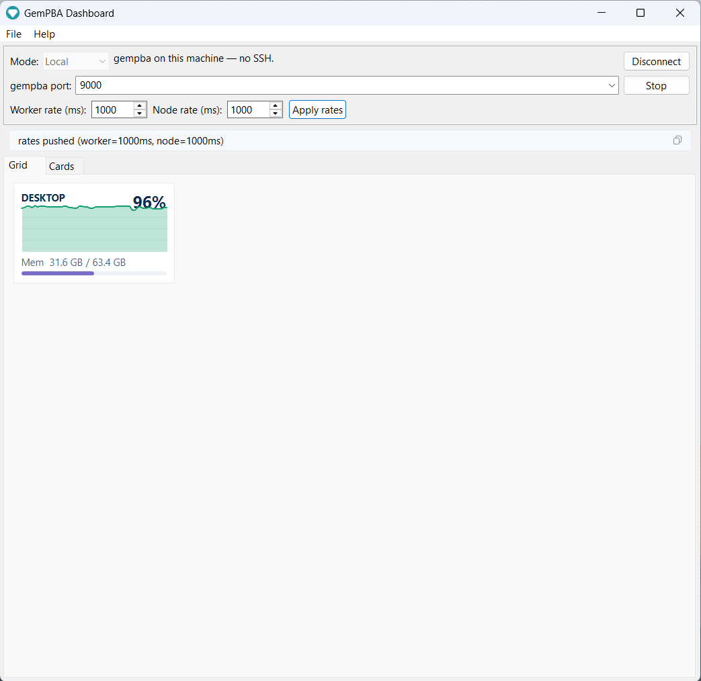
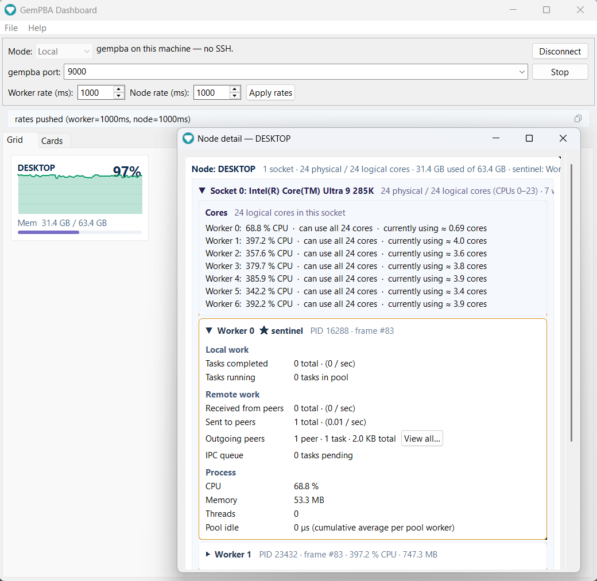
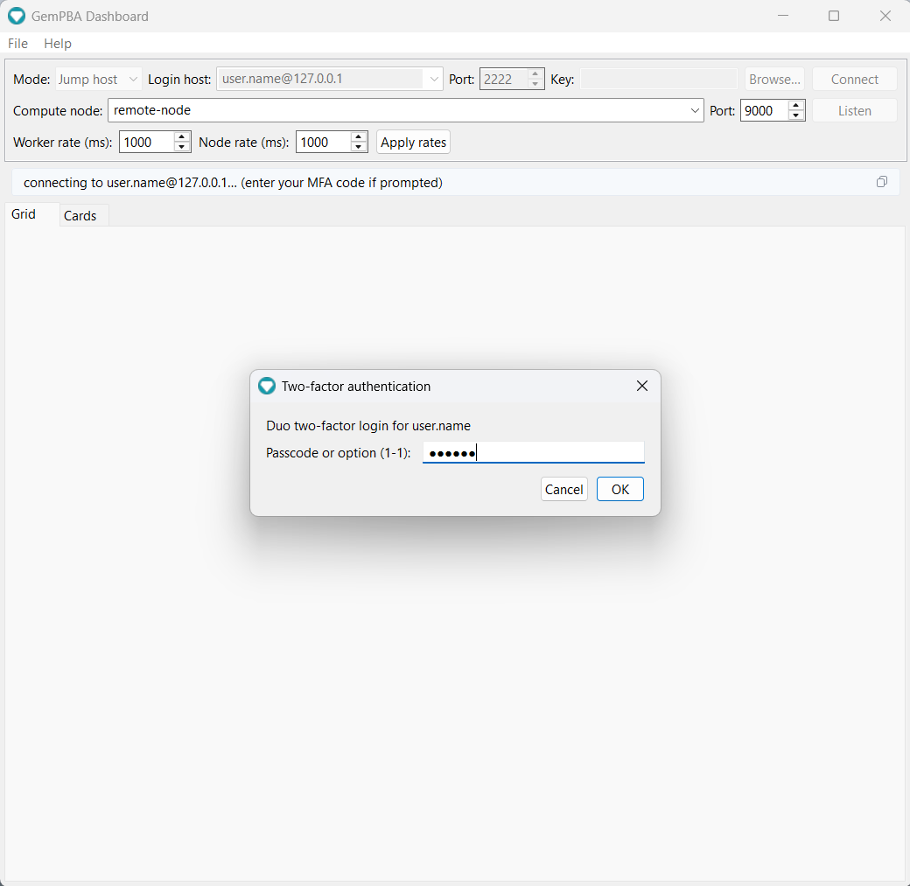

# Dashboard

The GemPBA Dashboard is a desktop app that connects to a running GemPBA program and shows the whole run live: every node, every worker, CPU and memory as they move, and the task traffic between processes. It reads the same [telemetry stream](index.md) the runtime already broadcasts, so any GemPBA program is observable in it with no extra code.

<figure markdown="span">
  
  <figcaption>The dashboard watching a live run: a node tile with rolling CPU and memory.</figcaption>
</figure>

**v1.0.0** · MIT · built in the open: every release is compiled by GitHub Actions from the tagged source. Source: [rapastranac/gempba-dashboard](https://github.com/rapastranac/gempba-dashboard).

## What it shows

- **Grid**: one tile per node with a live CPU sparkline and a memory bar. Scales from your laptop to a multi-node cluster at a glance.
- **Node detail**: click a node for the full breakdown, each socket and its cores, per-worker CPU%, CPU affinity and the cores actually in use, local vs remote task flow, outgoing peers and bytes, and the IPC queue depth.
- **Cards**: a hierarchical view of the run, world to node to socket to worker to cores, every level live on each frame.
- **Live rate control**: retune how often workers and nodes report, right from the toolbar. Because gempba is compiled into your application, a job already running on a cluster is a fixed binary, yet you change its telemetry cadence on the fly, with no recompile, restart, or resubmit.

<figure markdown="span">
  
  <figcaption>Node detail: per-socket cores, per-worker CPU and affinity, task flow, and outgoing peers.</figcaption>
</figure>

The per-worker CPU and per-job memory shown here come straight from the runtime's v4.2.0 telemetry (see [Releases](../releases.md)): real per-socket placement and cgroup-aware memory, so on a shared node the numbers are gempba's own, not the whole machine's.

## Download and run

Grab the app-image for your OS from the [latest release](https://github.com/rapastranac/gempba-dashboard/releases/latest), unzip, and run. The Java runtime is bundled, so there is **no JDK to install**.

[Download for Windows, Linux, or macOS](https://github.com/rapastranac/gempba-dashboard/releases/latest){ .md-button .md-button--primary }

| OS | Asset | Run |
|---|---|---|
| Windows x64 | `gempba-dashboard-1.0.0-windows-x64.zip` | unzip, then `gempba-dashboard.exe` |
| Linux x64 | `gempba-dashboard-1.0.0-linux-x64.zip` | unzip, then `bin/gempba-dashboard` |
| macOS (Apple Silicon) | `gempba-dashboard-1.0.0-macos-aarch64.zip` | unzip, then open `gempba-dashboard.app` |

!!! note "First launch on Windows and macOS"
    The app-images are unsigned. On Windows, SmartScreen may warn: click **More info**, then **Run anyway**. On macOS, right-click the app and choose **Open** the first time (or run `xattr -dr com.apple.quarantine gempba-dashboard.app`). Linux has no prompt.

Prefer to build it yourself? With JDK 25 and Maven: `mvn -B -pl app exec:java`.

## Connect

Pick a mode in the toolbar. The dashboard's SSH client is built in, so reaching a remote run needs no separate tunnel.

### Local

gempba is running on this machine. Point the dashboard at the telemetry port (9000 by default) and connect. This is the view at the top of this page.

<figure>
  
<iframe src="https://www.youtube.com/embed/2rU9Tkp7RHY?si=T_BIpYuaagzREpnf" title="GemPBA Dashboard: connecting to a local run" allow="accelerometer; autoplay; clipboard-write; encrypted-media; gyroscope; picture-in-picture; web-share" referrerpolicy="strict-origin-when-cross-origin" allowfullscreen></iframe>

  <figcaption>Connecting to a local run.</figcaption>
</figure>

### Host or jump host

gempba is on a remote machine or an HPC compute node. The dashboard opens the SSH tunnel for you: a single hop for a directly reachable host, or login node then compute node for a cluster. It answers keyboard-interactive MFA (Duo) in a dialog and auto-trusts the per-job compute-node host key (`accept-new`), so one prompt at the login node is all it takes.

<figure markdown="span">
  
  <figcaption>Jump-host mode answers the login node's MFA prompt in-app.</figcaption>
</figure>

<figure>
  
<iframe src="https://www.youtube.com/embed/Ko1T0aUqoXY?si=rdwQuJkc2QAo6kOB" title="GemPBA Dashboard: connecting through an MFA jump host" allow="accelerometer; autoplay; clipboard-write; encrypted-media; gyroscope; picture-in-picture; web-share" referrerpolicy="strict-origin-when-cross-origin" allowfullscreen></iframe>

  <figcaption>Connecting to a compute node through an MFA login node.</figcaption>
</figure>

The gempba port must match the one the run bound (see [Configuration](configuration.md#the-dashboard-port)). For how to find which host runs rank 0, see [Connecting](connecting.md).

## Live control

Once connected, the **Worker rate** and **Node rate** fields set how often each frame type is emitted, and **Apply rates** pushes them to the live run. This is more than a convenience. gempba is a library you compile into your own application, so a job already running on a cluster is a fixed binary you cannot edit; changing what it reports would normally mean stopping it, editing code, recompiling, and resubmitting to the scheduler. Instead the dashboard sends the new cadence to the running processes over the open connection, so you can dial detail up while you watch a long job and back down when you step away, without ever touching the run. This is the client side of the runtime's [live cadence control](configuration.md#emission-cadence-and-live-control).

## Headless or scripted?

If you want the stream without a GUI (a terminal tail, a log, a custom consumer), the bundled `telemetry_view` / `telemetry_tunnel` scripts and the raw JSON protocol are documented under [Connecting](connecting.md) and [Data model](data-model.md).

## Source and license

[rapastranac/gempba-dashboard](https://github.com/rapastranac/gempba-dashboard), MIT. Issues and contributions are welcome there. Every published app-image is built by GitHub Actions from the tagged source.
