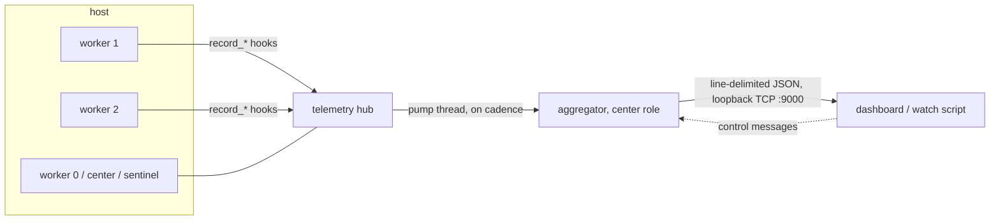

# Telemetry

GemPBA ships with a built-in **runtime telemetry** system. While your search runs, every worker publishes a live stream of what it is doing: tasks dispatched, sent, received, and running; thread-pool idle time; scheduler backlog; per-process CPU and memory; and a worker-to-worker traffic matrix, alongside per-host CPU/memory/network/disk and the full hardware topology. It is **on by default**, in every flavor (`mt` and `mp-mpi`), so your production runs are observable out of the box with nothing to wire up.

!!! info "Built in, on by default"
    Telemetry is compiled into the library, so there is no build flag to enable it; it starts automatically when the runtime comes up. Opt out at runtime with `gempba::telemetry::disable()` (see [Configuration](configuration.md)). Hardware-topology fields are populated when GemPBA is built with hwloc (`GEMPBA_HWLOC`, on for releases); without it, core/socket counts read as 0 and everything else still works.

## Why it's in the box

Live, per-worker observability across a distributed run is normally a project of its own: a metrics sidecar to deploy, a transport that won't perturb the workload, a schema everyone has to agree on, and some way to reach processes scattered across nodes. GemPBA handles that part. Telemetry rides its **own private MPI communicator** (`MPI_Comm_dup`), so it never collides with application traffic; it aggregates every rank into a single stream; and it exposes that stream on a channel a client can not only read but **steer**. Emission cadence is retunable live, mid-run, without restarting the job (see [Configuration](configuration.md#emission-cadence-and-live-control)).

## One implementation, every binding

Telemetry lives in the C++ runtime, beneath the public API, not in any one front-end. So every binding inherits it for free: the [Java binding](../java/index.md) is fully observable today with no telemetry-specific code, and anything else built on the [stable C ABI](../java/how-it-works.md) would consume the same stream the same way. There is no per-language telemetry to write or keep in sync; there is one implementation, in the core.

## What it gives you

- **Per-worker frames**: cumulative task counters (local / sent / received), tasks currently running, scheduler pending count, average pool idle time, process CPU %, RSS, thread count, and a per-destination **traffic matrix** (`edges_out[dst]`) for visualizing how work flows between workers.
- **Per-host frames**, emitted by one "sentinel" worker per host: per-socket CPU and memory, total/available memory, and aggregate network and disk counters.
- **Topology snapshot**, captured once at startup: every host, the workers it owns, per-socket physical/logical core counts, CPU names, and CPU-id lists. Frames carry numeric `worker_id`s; the topology maps them back to host and hardware.
- **Live control**: a connected client can retune the worker and host emission cadence, and promote a host sentinel, on the fly, so a dashboard can dial detail up while you watch and back down for long unattended runs.

## How it fits together

- **The hub** (`gempba::telemetry::telemetry_hub`): one per process. Workers feed it through lock-free `record_*` hot-path hooks; a pump thread periodically snapshots the counters into frames and pushes them over the transport.
- **Transports**, chosen by runtime mode: an in-process **local** transport for `mt`, and an **MPI** transport on a *private* communicator (`MPI_Comm_dup`, so telemetry never collides with application traffic) for `mp-mpi`, auto-installed inside `create_scheduler` on every rank.
- **The center role**: one process aggregates all frames and runs a **loopback-only TCP server** (default `127.0.0.1:9000`) that broadcasts the merged stream as line-delimited JSON to any number of connected clients. That socket is the dashboard channel.

## Where to go next

- **[Configuration](configuration.md)**: the runtime kill switch (C++ and Java), the TCP port, and emission cadence and live control.
- **[Connecting](connecting.md)**: live-tail a local run, or tunnel into a remote rank with the bundled helper scripts.
- **[Data model](data-model.md)**: the frame structs and the JSON broadcast shape a consumer reads.
- **[Dashboard](dashboard.md)**: the planned web dashboard, and how to consume the stream today.
